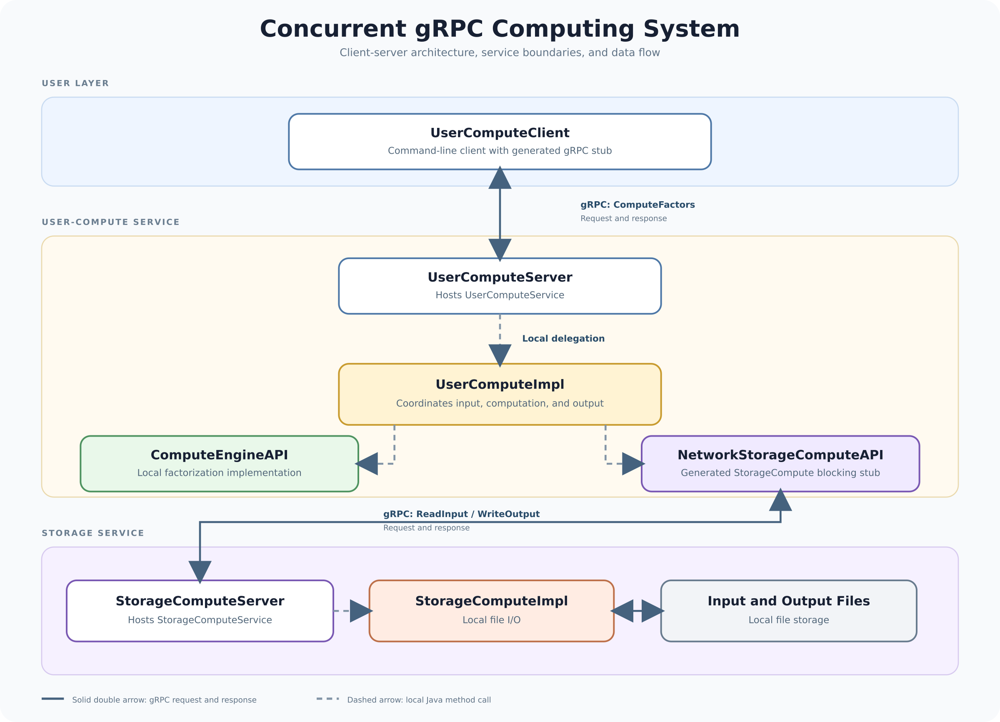

# Concurrent gRPC Computing System

A Java client-server application that uses **gRPC** and **Protocol Buffers** to coordinate computation and file-storage operations across separate services.

The project demonstrates remote procedure calls, service-oriented architecture, bounded concurrency, automated testing, and algorithm optimization.

## System Architecture



### Request Flow

1. `UserComputeClient` sends a `ComputeFactors` request to `UserComputeServer`.
2. The server delegates the request to `UserComputeImpl`.
3. Input values are retrieved from the storage service using gRPC.
4. `ComputeEngineAPI` performs factorization locally.
5. The processed results are sent back to the storage service and written to an output file.
6. The server returns a response to the client.

## Key Features

* Separate computation and storage services
* gRPC communication using generated blocking stubs
* Protocol Buffer service and message definitions
* File-based input and output
* Factorization using interchangeable computation implementations
* Four-thread bounded concurrency implementation
* Input validation and gRPC error handling
* Unit, performance, concurrency, and end-to-end tests

## gRPC Services

### UserComputeService

Coordinates the overall computation workflow.

```proto
rpc ComputeFactors(UserComputeRequest)
    returns (UserComputeResponse);
```

### StorageComputeService

Reads input values from a file and writes processed results.

```proto
rpc ReadInput(ReadInputRequest)
    returns (ReadInputResponse);

rpc WriteOutput(WriteOutputRequest)
    returns (WriteOutputResponse);
```

## Concurrency

The project includes a bounded concurrency implementation using a fixed pool of four worker threads. This allows multiple computation jobs to be submitted without creating an unlimited number of threads.

The concurrency layer is tested independently and is not currently connected to the default server runtime.

## Performance Optimization

Two factorization implementations are included:

* A baseline algorithm that checks every possible divisor
* An optimized algorithm that handles `2` separately and checks only odd divisors afterward

For the included benchmark workload, the optimized implementation reduced median execution time from approximately **164.7 ms to 81.4 ms**, an improvement of about **50.6%**.

Benchmark results may vary depending on hardware and input data.

## Testing

The test suite includes:

* Unit tests for computation and storage behavior
* Tests for concurrent job submission
* Performance comparisons between factorization implementations
* An end-to-end test using real gRPC servers

The end-to-end test starts both services on temporary ports, sends a request through a generated gRPC client stub, and verifies the output file.

Run all tests with:

```bash
./gradlew test
```

On Windows:

```powershell
gradlew.bat test
```

## Technology Stack

* Java
* gRPC
* Protocol Buffers
* Gradle
* JUnit
* Git and GitHub

## Current Limitations

* Input and output are stored in local text files.
* The bounded concurrency layer is not connected to the default server runtime.
* The coordinated workflow selects the largest factor from each calculated factor list, which is the original positive input value.
